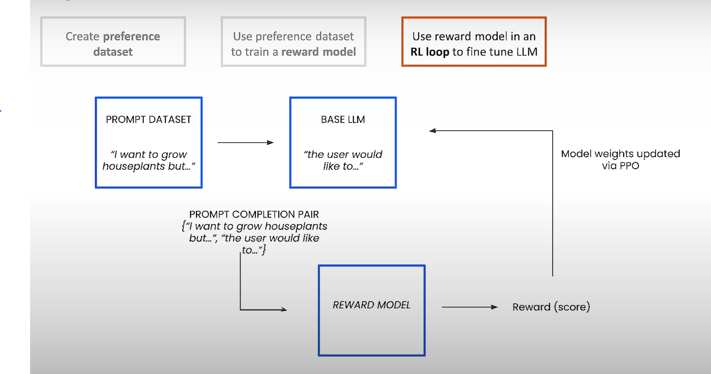
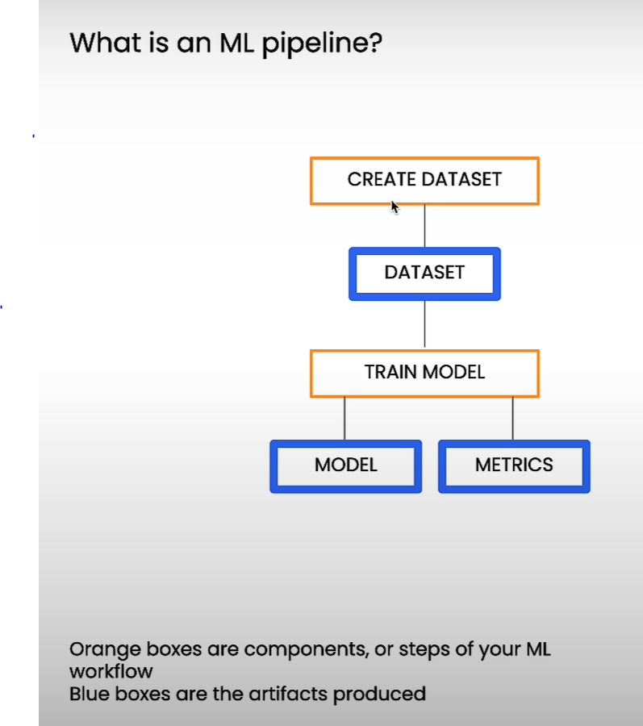
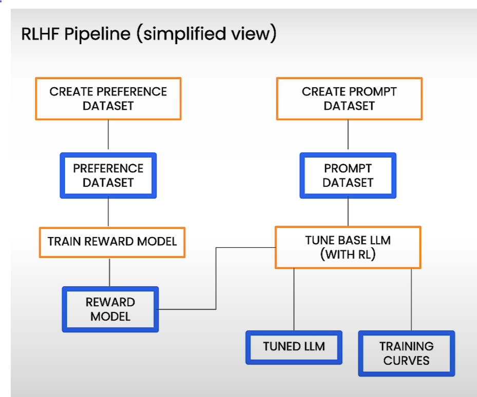

# Reinforcement Learning From Human Feedback (RLHF) Crash Course

## Acknowledgment

This repository contains notes and practical implementations from the crash course on Reinforcement Learning From Human Feedback (RLHF) offered by DeepLearning.AI, delivered by Prof. Andrew Ng in collaboration with Google. The primary applications discussed in this course are text summarization and text autocompletion.

## Table of Contents

1. [Introduction](#introduction)
2. [How Does RLHF Work?](#how-does-rlhf-work)
3. [Datasets for RL Training](#datasets-for-rl-training)
4. [Tune an LLM with RLHF](#tune-an-llm-with-rlhf)
5. [Evaluate the Tuned Model](#evaluate-the-tuned-model)
6. [Google Cloud Setup](#google-cloud-setup)
7. [Conclusion](#conclusion)

## Introduction

Reinforcement Learning from Human Feedback (RLHF) is a technique designed to fine-tune large language models (LLMs) by incorporating human preferences into the training process. This approach is particularly valuable for tasks like text summarization and text autocompletion, where human judgment is essential for achieving high-quality outputs.

### Why RLHF?

Traditional machine learning models, when trained purely on data, often produce outputs that are technically correct but may miss the nuances of human preferences. For example, a model trained to summarize a news article might generate a summary that is factually accurate but fails to highlight the key points that readers care most about. RLHF addresses this by integrating direct human feedback, resulting in summaries that are not only accurate but also aligned with what humans find most relevant.

## How Does RLHF Work?

RLHF works by integrating human feedback into the model's training process. The model is refined iteratively based on this feedback, resulting in outputs that better align with human expectations.

- **Conceptual Overview**: The RLHF process involves training a model by iteratively adjusting its outputs based on human preferences. Human labelers review model outputs and indicate which ones align more closely with the desired outcomes.

- **Example Task - Text Summarization**: Consider a model designed to summarize news articles. Initially, the model might produce several summaries that are technically correct but vary in quality. Human evaluators review these summaries and select the ones that best capture the most critical aspects of the article. For instance, if the article is about a new scientific discovery, the preferred summary might focus on the discovery's implications rather than the technical details.

### Model Training Approaches

1. **Supervised Fine-Tuning**:
    - This approach involves training a model on a labeled dataset where each input is paired with a desired output. The goal is to teach the model the relationship between inputs and outputs.
    - **Data Format**: `{input text, summary}`
    - **Example**: Suppose the input is a detailed report on climate change. The desired output might be a summary that highlights the most urgent findings and recommendations, which the model learns to produce through supervised training.

2. **Reinforcement Learning from Human Feedback (RLHF)**:
    - RLHF incorporates human feedback into the training process, allowing the model to learn from subjective preferences rather than just correct/incorrect labels.
    - **Data Format**: `{input text, summary 1, summary 2, human preference}`
    - **Example**: Given an input text describing a political event, the model generates multiple summaries. Human evaluators might prefer a summary that emphasizes the event's impact on international relations rather than internal politics. The model is then fine-tuned to produce more summaries that align with these preferences.

   One challenge in RLHF is the variability in human preferences, which can differ between individuals. However, by aggregating feedback from multiple evaluators, the model can learn a general preference pattern.

*// This image visualizes the basic workflow of RLHF, showing how human feedback guides the model towards more desirable outputs.*

## Datasets for RL Training

Successful RLHF implementation depends on well-prepared datasets. The following are essential:

1. **Preference Dataset**: Contains pairs of input texts and multiple model-generated outputs, along with labels indicating human preferences. This dataset is used to train the reward model.

    - **Example**: In the context of text summarization, the dataset might include a research paper followed by several different summaries, with labels indicating which summary better captures the key findings and conclusions.

2. **Prompt Dataset**: A collection of prompts used to generate outputs from the LLM during fine-tuning.

    - **Example**: For autocompletion tasks, prompts could be the beginning of a sentence like "The economic impact of the pandemic has been..." that the model needs to complete in a coherent and contextually appropriate manner.

3. **Data Preparation**: Ensure that datasets are formatted in JSON Lines and stored in Google Cloud Storage (GCS). Proper data organization is crucial for smooth training operations.

### Reward Model Training

The reward model is trained using the preference dataset. It learns to predict a score for each output based on how well it aligns with human preferences.

- **Example**: If the input is a technical article, and one summary focuses on technical details while another provides a broader overview, the reward model might learn to score the broader overview higher if that's what human evaluators consistently prefer.

*// This image illustrates the training phase of the reward model, where it learns to assign scores based on human preferences.*

### Reward Model Inference

After training, the reward model is used during inference to evaluate new outputs. It assigns a score to each output, guiding the model toward producing preferred outputs.

- **Example**: During inference, if the LLM generates several possible summaries for a given article, the reward model will score these summaries. The highest-scoring summary might be one that most effectively captures the article's main argument or narrative, depending on learned human preferences.

*// This image shows the inference phase, where the reward model evaluates new model outputs and provides feedback in the form of a scalar score.*

### Reinforcement Learning Loop

The reinforcement learning loop is the core of RLHF, where the model is iteratively fine-tuned based on the reward model's scores.

1. **Generate Outputs**: The LLM generates multiple completions for a given prompt.
2. **Score Outputs**: The reward model scores each completion.
3. **Update LLM**: The model's parameters are updated based on the scores, encouraging the LLM to produce higher-scoring outputs in future iterations.

- **Example**: In a text autocompletion scenario, the LLM might generate different ways to complete the sentence "The climate crisis demands..." The reward model might score higher a completion like "...immediate global cooperation and innovation" if evaluators prefer completions that emphasize urgent action.

*// This image illustrates the autocompletion process in RLHF, where the LLM generates responses, the reward model scores these responses, and the LLM is fine-tuned through the RL loop to improve its outputs.*

### Agent-Environment Interaction in RLHF

In RLHF, the LLM acts as the agent interacting with its environment. The agent generates text completions and receives rewards based on how well these actions align with human preferences.

- **Example**: The environment includes the context of the text being generated, such as a partially completed sentence or a prompt, while the reward model provides feedback on how well the completion aligns with preferred outcomes.

*// This image represents the RL loop where the agent interacts with the environment, receiving rewards based on its actions.*

### Policy Optimization in RLHF

The LLM's policy is optimized using algorithms like Proximal Policy Optimization (PPO). This ensures that the model continues to improve in producing outputs that align with human feedback.

- **Example**: Over several iterations, the LLM might learn that, in text summarization, it is generally better to emphasize conclusions and actionable insights over methodological details, if this aligns with human evaluators' preferences.

*// This image shows how the LLM’s policy is optimized using RL algorithms to better align with human feedback.*

For the Dataset exploration refer to [L2_explore_data.ipynb](src/L2/L2_explore_data.ipynb).

## Tune an LLM with RLHF

### Comparison of Pipelines

To understand the difference between a standard ML pipeline and an RLHF pipeline, consider the following illustrations:

*// This image depicts a standard ML pipeline, showing the creation of a dataset, training the model, and generating the model and metrics as outputs. The key difference from the RLHF pipeline is the absence of a reinforcement learning loop and the specialized datasets for preference and prompts.*

*// This image provides a simplified view of the RLHF pipeline. It highlights the unique aspects of RLHF, such as the creation of a preference dataset and a prompt dataset, training the reward model, and using reinforcement learning to fine-tune the LLM. The outcome includes a tuned LLM and training curves that reflect its performance improvement.*

Refer to the [L3_tune_llm.ipynb](src/L3/L3_tune_llm.ipynb).

## Evaluate the Tuned Model

Evaluation is critical to ensure that the tuned model meets performance expectations:

- **Evaluation Metrics**: Use metrics such as accuracy, precision, recall, and F1 score, alongside human evaluation, to assess model performance.
- **Validation Process**: Run the model on a separate validation dataset and compare the outputs with human-preferred outcomes.
- **Iterative Improvement**: Based on evaluation results, further tuning may be necessary. This process is iterative and continues until the model’s performance is satisfactory.

- **Example**: In evaluating a model trained for text summarization, you might find that while the model is good at brevity, it occasionally omits critical information. Based on this insight, you would further fine-tune the model to balance conciseness with completeness.

Refer to the [L4_evaluate_model.ipynb](src/L4/L4_evaluate_model.ipynb).

## Google Cloud Setup

Setting up the RLHF pipeline on Google Cloud involves several steps:

- **Google Cloud Storage**: Store datasets in GCS buckets, ensuring proper organization and accessibility. Datasets should be in JSON Lines format.
- **Vertex AI Configuration**: Vertex AI pipelines are configured using YAML files, defining steps and parameters for the training process. This allows for scalable and automated model training and deployment.
- **Execution Best Practices**: Start with smaller datasets to validate pipeline functionality before scaling up. Use tools like TensorBoard to monitor training progress.

Refer to the [L5_google_cloud_setup.ipynb](src/L5/L5_google_cloud_setup.ipynb).

## Conclusion

RLHF is a powerful method for aligning AI models with human preferences, enhancing their reliability and ethical considerations. By following the steps outlined in this course, you can apply RLHF effectively to your models, improving their performance and alignment with human values.

This course has provided a comprehensive overview, from conceptual foundations to practical implementation and evaluation. Continue experimenting and refining your models to fully leverage the potential of RLHF in your AI projects.

