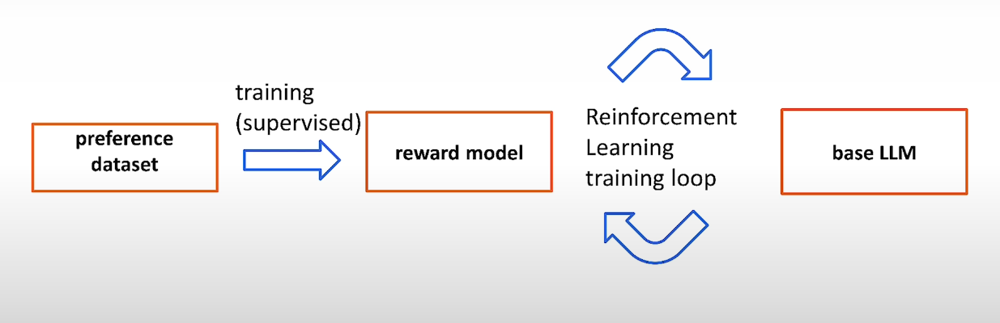
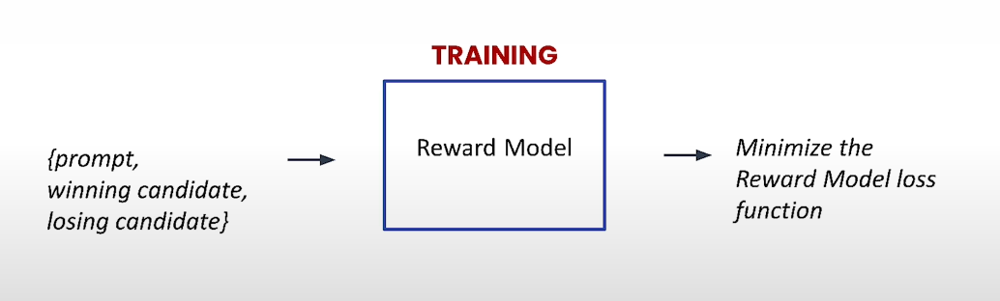
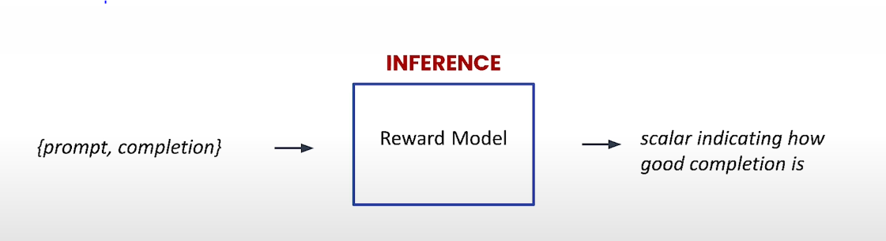
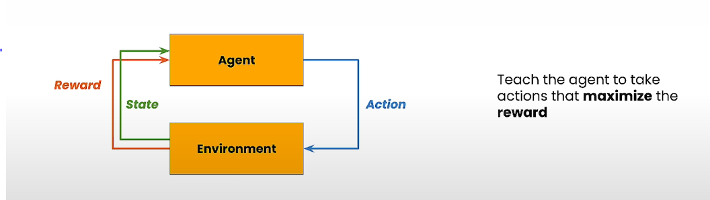
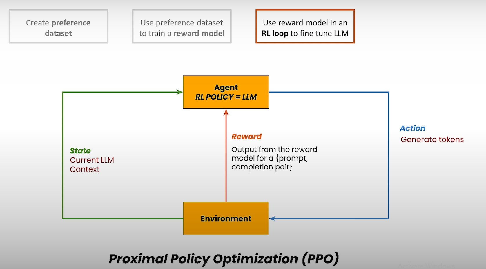

### Reinforcement Learning From Human Feedback (RLHF) Crash Course

## Acknowledgment

This repository is my collection of notes and practical implementations from the crash course on Reinforcement Learning From Human Feedback (RLHF) offered by DeepLearning.AI and delivered by Prof. Andrew Ng in collaboration with Google. The primary applications discussed in this course are text summarization and text autocompletion.

## Table of Contents

1. [Introduction](#introduction)
2. [How Does RLHF Work?](#how-does-rlhf-work)
3. [Datasets for RL Training](#datasets-for-rl-training)
4. [Tune an LLM with RLHF](#tune-an-llm-with-rlhf)
5. [Evaluate the Tuned Model](#evaluate-the-tuned-model)
6. [Google Cloud Setup](#google-cloud-setup)
7. [Conclusion](#conclusion)

## Introduction

Reinforcement Learning from Human Feedback (RLHF) is a technique that aligns the outputs of large language models (LLMs) with human preferences. This process is crucial in creating AI systems that produce outputs that are not only accurate but also contextually aligned with human expectations.

## How Does RLHF Work?

RLHF enhances LLMs by integrating human feedback into the training process. Here's how it works:

- **Conceptual Overview**: RLHF involves training a model by iteratively refining its outputs based on human preferences. These preferences are captured through a process where human labelers evaluate model outputs and indicate which ones align more closely with desired outcomes.

- **Example Task**: Consider tuning a model for summarization. Initially, various summaries of a text are generated. Human evaluators then choose the summaries that best capture the essence of the original text. These preferences are used to fine-tune the model, guiding it towards producing preferred outputs.

### Model Training Approaches

1. **Supervised Fine-Tuning**:
    - In this approach, a model is trained on a dataset where each input is paired with a desired output. The goal is for the model to learn the relationship between inputs and outputs so that it can generalize to new, unseen data.
    - **Data Format**: `{input text, summary}`
    - **Example**: Given a text input, the model is trained to produce the corresponding summary.

2. **Reinforcement Learning from Human Feedback (RLHF)**:
    - RLHF is a method where a model is trained not just on correct answers but also on feedback from human evaluators. This technique is often used to refine a model's behavior by comparing multiple outputs and selecting the one preferred by human judges.
    - **Data Format**: `{input text, summary 1, summary 2, human preference}`
    - **Example**: Given an input text, the model generates multiple summaries, and human evaluators indicate which summary is better. The model is then fine-tuned based on these preferences.

   One of the primary challenges in RLHF is dealing with the subjective nature of human preferences, which can vary significantly between individuals and contexts.

*// This image visualizes the basic workflow of RLHF, showing how human feedback guides the model towards more desirable outputs.*

## Datasets for RL Training

Preparing the right datasets is critical for successful RLHF. The following datasets are essential:

1. **Preference Dataset**: This dataset contains pairs of input texts and their corresponding model-generated outputs, along with labels indicating human preferences between the pairs. This dataset is used to train the reward model, which scores the outputs based on how well they align with human preferences.

2. **Prompt Dataset**: A collection of prompts used to generate outputs from the LLM. These prompts are crucial for the initial fine-tuning phase of the LLM.

3. **Data Preparation**: Ensure that datasets are formatted in JSON Lines and stored in Google Cloud Storage (GCS). Proper organization and structure of these datasets are essential for smooth operation during training.

Here are the stages of RLHF:
Refer to [L2_explore_data.ipynb](src/L2/L2_explore_data.ipynb)

**Preference dataset**:
- Data Format: `{input text, candidate 1, candidate 2, human preference of 1 or 2}`

### Reward Model Training
The reward model is trained using the preference dataset. The model learns to predict a scalar value that indicates how well a given completion (summary, in this case) aligns with human preferences.

*// This image illustrates the training phase of the reward model, where it learns to assign scores based on human preferences.*

### Reward Model Inference
After training, the reward model is used in the inference phase to evaluate new completions. It assigns a score indicating how good the completion is based on the learned preferences.

*// This image shows the inference phase, where the reward model evaluates new model outputs and provides feedback in the form of a scalar score.*

### Reinforcement Learning Loop
Once the reward model is trained, it is integrated into a reinforcement learning loop. The loop involves the following steps:
1. Generate multiple completions for a given prompt.
2. Use the reward model to score each completion.
3. Update the language model (LLM) based on the scores, encouraging it to produce higher-scoring completions in future iterations.

### Agent-Environment Interaction in RLHF
In reinforcement learning, the process can be visualized as an interaction between an agent (the LLM) and an environment. The agent takes actions (generating text completions) and receives rewards (scores from the reward model) based on how well these actions align with human preferences.

*// This image represents the RL loop where the agent interacts with the environment, receiving rewards based on its actions.*

### Policy Optimization in RLHF
The LLM's policy (the strategy it uses to generate text) is optimized using reinforcement learning algorithms like Proximal Policy Optimization (PPO). The goal is to maximize the expected reward, leading to more human-aligned outputs.

*// This image shows how the LLM’s policy is optimized using RL algorithms to better align with human feedback.*

## Tune an LLM with RLHF

Tuning an LLM using RLHF involves several key steps:

- **Training the Reward Model**: The reward model is trained using the preference dataset. This model assigns scores to outputs based on their alignment with human preferences, guiding the LLM towards generating more desirable outputs.

- **Reinforcement Learning Loop**: The fine-tuning process involves using the reward model in a reinforcement learning loop, where the LLM is adjusted to maximize the reward score.

- **Parameter Tuning**: Various parameters, such as the number of training epochs, batch size, learning rates, and KL coefficients, are fine-tuned to optimize the model's performance.

- **Implementation on Vertex AI**: Google Cloud’s Vertex AI platform is used to implement the RLHF pipeline. The pipeline components include data preparation, model training, and evaluation, all managed within a scalable and flexible cloud environment.

Refer to the [L3_tune_llm.ipynb](src/L3/L3_tune_llm.ipynb).

## Evaluate the Tuned Model

After tuning, it’s essential to evaluate the model to ensure that it meets the desired performance criteria:

- **Evaluation Metrics**: Metrics such as accuracy, precision, recall, and F1 score are used to assess the model's performance. Additionally, human evaluation is critical to ensure the model's outputs align with qualitative human preferences.

- **Validation Process**: The validation process involves running the model on a separate validation dataset and comparing the outputs with human-preferred outcomes.

- **Iterative Improvement**: Based on evaluation results, further tuning may be required. This iterative process continues until the model’s performance is satisfactory.

Refer to the [L4_evaluate_model.ipynb](src/L4/L4_evaluate_model.ipynb).

## Google Cloud Setup

Setting up the RLHF pipeline on Google Cloud involves several steps:

- **Google Cloud Storage**: Store your datasets in GCS buckets, ensuring they are correctly organized and accessible. Each dataset should be in the JSON Lines format and correctly referenced in the pipeline’s configuration.

- **Vertex AI Configuration**: Vertex AI pipelines are configured using YAML files, which define the various steps and parameters involved in the training process. This setup allows for scalable and automated model training and deployment.

- **Execution Best Practices**: Start with smaller datasets to ensure the pipeline is functioning correctly before scaling up. Monitor the training process using tools like TensorBoard to track the model's progress.

Refer to the [L5_google_cloud_setup.ipynb](src/L5/L5_google_cloud_setup.ipynb).

## Conclusion

RLHF is a powerful technique for aligning AI models with human preferences, making them more reliable and ethically sound. By following the steps outlined in this course, you can effectively apply RLHF to your models, improving their performance and alignment with human values.

This course has provided a comprehensive overview, from the conceptual foundation to practical implementation and evaluation. Continue experimenting and refining your models to fully leverage the power of RLHF in your AI projects.

